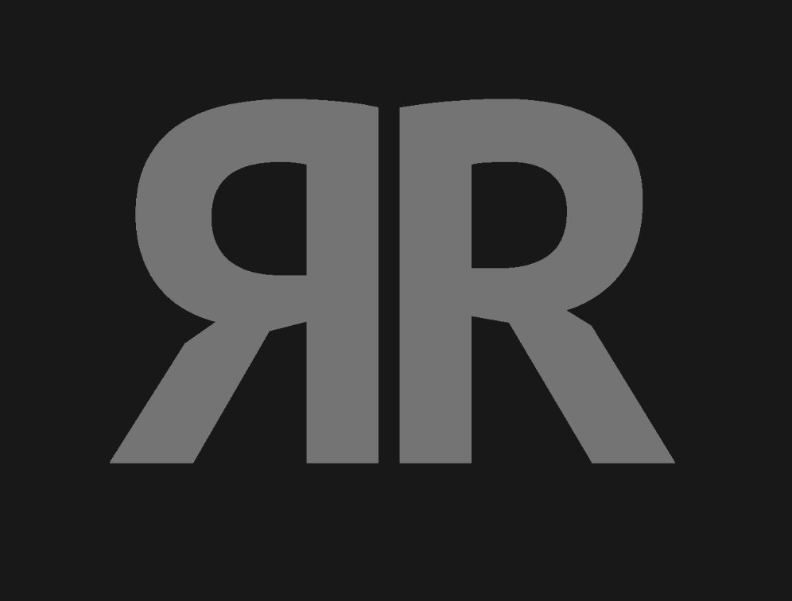
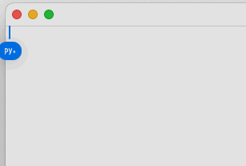

# ЯR Switcher

Бесплатная замена **Punto Switcher / Caramba / etc** для macOS: выделите текст, набранный в неправильной раскладке, нажмите горячую клавишу — и он станет правильным.



Работает  **c любой парой раскладок** (русская ↔ английская, немецкая ↔ английская и т.д.), читает их прямо из macOS — без хардкода и «костылей» на каждый язык.

  

##### Скачайте последний релиз: [YRSwitcher.dmg](https://github.com/gluck-59/yr-switcher/releases/latest/download/YRSwitcher.dmg)

## Чем ЯR Switcher отличается от других?

В ЯR Switcher всего одна функция: переключение раскладки выделенного текста горячей клавише. Как дополнение —  переключение раскладки **последнего слова**,  когда ничего не выделено.
Здесь нет и не будет комбайна из проверки орфографии, автоматических переключений, ИИ, записи экрана, правил и исключений, измерения скорости интернета и т.д. и т.п.

## Возможности

- **Любые раскладки.** Маппинг символов строится динамически из системных данных клавиатуры (`UCKeyTranslate`). Поддерживаются ANSI/ISO/JIS клавиатуры — не нужно ждать поддержку «вашего» языка.
- **Одна клавиша.** Настроили хоткей один раз — переключаете текст в любом приложении: браузер, терминал, редактор, Telegram.
- **Конвертация «последнего слова».** Ничего не выделено? Приложение само возьмёт предыдущее слово и переключит его — идеально для чатов.
- **Настройка горячих клавиш.** Обычные сочетания (например ⌥⌘S) или «модификаторные» (нажатие и отпускание ⌥⌘ без букв).
- **Чистый clipboard.** Содержимое буфера обмена возвращается на место после конвертации.
- **macOS 10.15+ (Catalina и новее)**, универсальный бинарник для Intel и Apple Silicon.

## Сравнение

| | Punto Switcher | Caramba Switcher | **ЯR Switcher** |
|---|---|---|---|
| Цена | бесплатно, с рекламой | платная | бесплатно |
| Ошибки/глюки | частые | редкие | редкие |
| Любые раскладки | нет | да | да |
| минимальная версия macOS  | неизвестно | 12.0 | 10.15 |

## Установка

Скачайте последний релиз: [YRSwitcher.dmg](https://github.com/gluck-59/yr-switcher/releases/latest/download/YRSwitcher.dmg)

Приложение подписано self-signed (не нотаризовано). При первом запуске macOS может показать предупреждение Gatekeeper:

1. Откройте **Системные настройки → Конфиденциальность и безопасность**.
2. Нажмите **«Всё равно открыть»** (Open Anyway).

Или выполните в терминале:
```bash
xattr -cr /Applications/YRSwitcher.app
```

Затем дайте разрешение **Доступность** (приложение откроет нужный раздел само) и задайте горячую клавишу в настройках.

## FAQ

**Работает ли с русской и английской раскладкой?**
Да, и не только: любые установленные раскладки — немецкая, французская и др.

**У меня не переключается текст в приложении X.** Убедитесь, что разрешение «Доступность» выдано, и что хоткей не конфликтует с системным.

**Это бесплатно? Где подвох?**
Бесплатно. Проект открыт, слежка и реклама отсутствуют, исходный код на GitHub.

## Сборка из исходников

Требуется Xcode Command Line Tools (`xcode-select --install`).

```bash
git clone https://github.com/gluck-59/yr-switcher.git
cd yr-switcher
make setup     # загрузка фреймворка Sparkle
make           # сборка универсального бинарника → build/YRSwitcher.app
make install   # копирование в /Applications
```

## Обратная связь

Баг или пожелание — [откройте issue](https://github.com/gluck-59/yr-switcher/issues).

## Credits

Проект основан на [Bilingual Switcher](https://github.com/komandakycto/bilingual-switcher) от komandakycto. Лицензия — [MIT](LICENSE).
